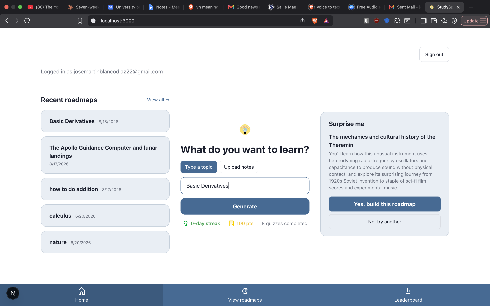
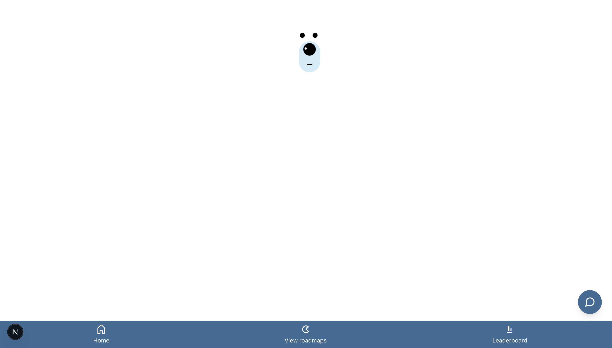
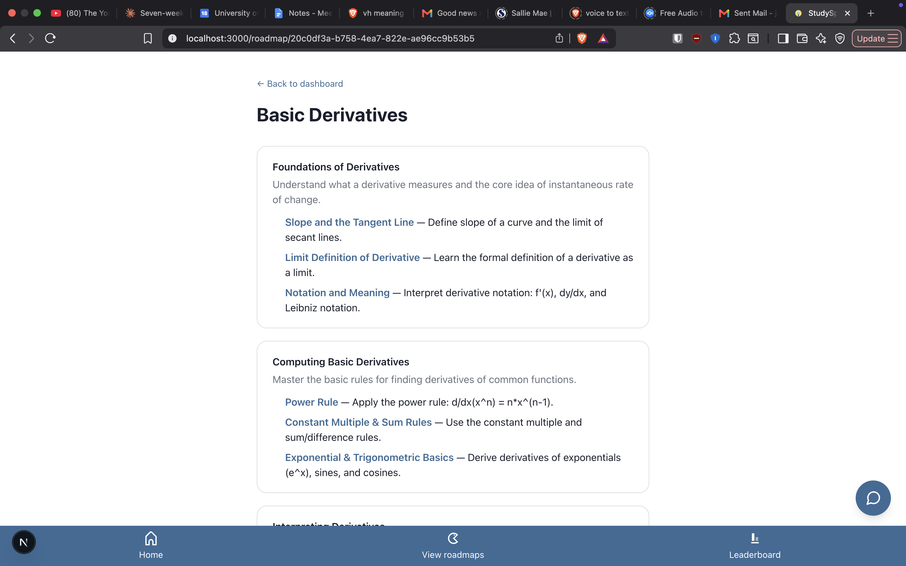
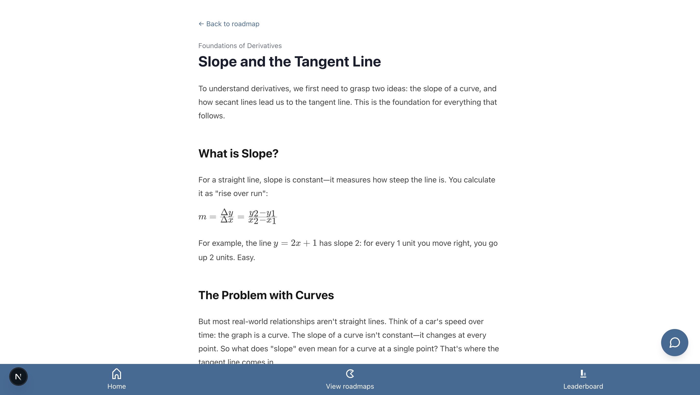
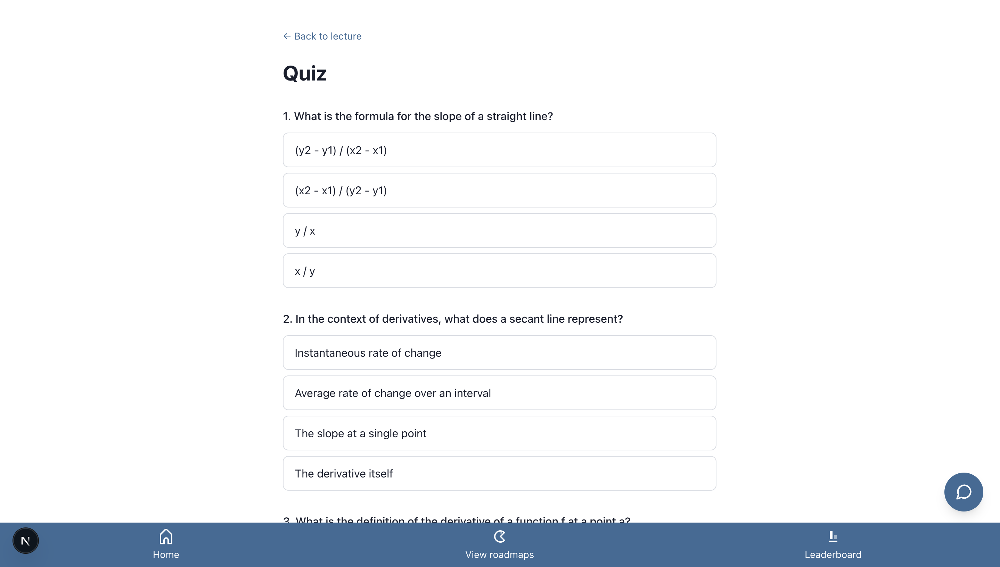
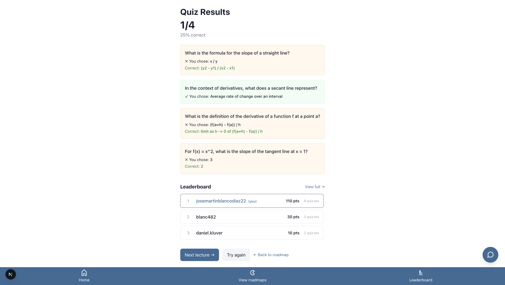
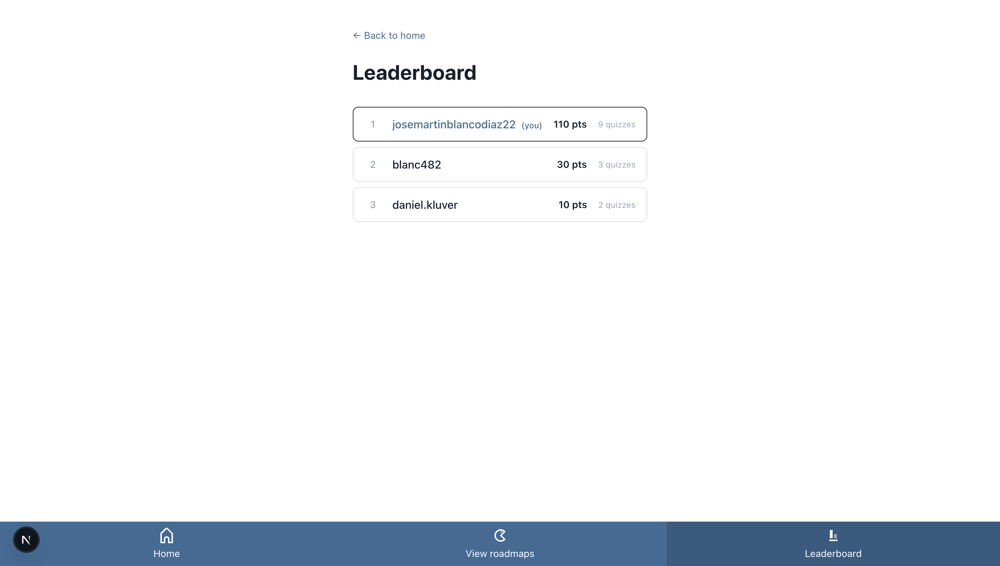

# StudySpark: Building an AI Generated Learning Platform

*A project report on what it takes to make a large language model reliably teach.*

   

> **Note on placeholders:** Anywhere you see `[INSERT ...]`, that's a spot for you to drop in a code sample, a screenshot, or a diagram. I've written a description of exactly what goes there. Code blocks that are already filled in are pulled from the real project — verify them against your current files before submitting, since a few may have drifted.

   

## Table of Contents

1. [Introduction](#1 introduction)
2. [State of the System](#2 state of the system)
3. [Core Technology & Architecture](#3 core technology  architecture)
     3.1 Core Technology
     3.2 Core Architecture
     3.3 Structured Output: Prove It, Don't Describe It
4. [How StudySpark Generates a Micro Lecture](#4 how studyspark generates a micro lecture)
     4.1 Stage 1 — Roadmap generation
     4.2 Stage 2 — Lecture generation
     4.3 Stage 3 — Figure resolution
5. [The Iterations: Where It Went Wrong](#5 the iterations where it went wrong)
     5.1–5.4 The four failures
     5.5 Principles
6. [What I'd Do Differently](#6 what id do differently)
7. [Reflection & What's Next — StudySpark 2](#7 reflection  whats next  studyspark 2)

   

## 1. Introduction

*Audience: everyone. Job: introduce the project to a reader who has never seen it, and hook them with the central realization.*

StudySpark is an online application designed for mobile phones that is built up of one feedback loop: you tell it what to teach you, and it teaches you. Type any topic "basics of derivatives," "how to hit a golf ball," "Nikola Tesla biography" and StudySpark will create for you a sequence of little lessons, each one based on the previous one.

Each lesson is what I refer to as a **micro lecture**, a short explanation in clear language. You get your information on one precise topic, and it is about 300 to 500 words long. It is automatically generated just for you instead of being taken from some fixed textbooks. The format is chosen deliberately. While a lecture consists of an hour long content as it has to include all of it, a micro lecture includes only one concept because you do not need anything else. You do not read a whole chapter in hope of finding that one paragraph that you lack but get that paragraph exactly.

Reading isn't the same as knowing, so every micro lecture is followed by a short quiz built from that exact lecture.That matters because it's the fastest way to find out whether you retained the material or not. A lecture can feel like it made sense while you're in class listening to it and still not stick five minutes later. The quiz allows you to catch what didn't stick before an exam does. Get something wrong, and you know precisely which part of the micro lecture to revisit, instead of re reading the whole thing and guessing where the gap was.

Reading isn't the same as knowing, so every micro lecture is followed by a short quiz built from that exact lecture. WThat matters because it's the fastest way to find out whether you retained the material or not. A lecture can feel like it made sense while you're in class listening to it and still not stick five minutes later. The quiz gives you an opportunity to identify the things you've missed before your final exam. If you make some mistakes in your quiz, you will be able to understand exactly what you should re learn.

None of the above is relevant to the case unless you have a reason to keep coming back. This is where progress, streaks, and points come into play. All of these features are not mere decoration but purposefully added to help you keep coming back and set yourself some goals. Streak helps you make studying fun instead of struggling with yourself to decide when to study. Leaderboard gives you a little incentive to open the application one time more. Instead of competing against yourself, you will be able to compete with your friends to see who is the most locked in, as I like to say.

Put together: you ask, StudySpark teaches the exact piece you're missing, tests whether it stuck, and gives you a reason to keep closing gaps instead of letting them pile up. Every piece of that content from the roadmap, to the lecture, and finally the quiz, is written live by a large language model, not authored in advance, which is what makes the whole loop possible on demand.

The project began as user research, not code. My team interviewed six undergraduates about how they study, and the same thing kept surfacing: it's not that students don't want to learn, it's that studying feels like one big, overwhelming, ambiguous task. Four findings shaped everything that followed: big tasks kill motivation, learning feels passive, visible progress builds momentum, and structure affects retention. StudySpark is an attempt to answer each of those with a feature.

Picture this: you just sat through your one hour lecture. Your professor covered everything you need to know, and covered it well, but an hour of college lecture is a firehose, and you caught most of it, but not all of it. Maybe you missed something while you were still writing down the last point. Maybe the one part that never quite clicked went by fast, and by the time you thought to raise your hand, class was ending and you were already sprinting across campus to the next one. The material existed. You just didn't get to keep all of it, and there was no good moment to ask.

StudySpark fills that gap between what was taught and what actually stuck. Instead of re reading a wall of notes and hoping the missing piece turns up on its own, you ask, and you get an answer, not a summary of the whole lecture, but the specific piece you forgot. Now you can focus on what you missed and that question you wanted to ask but didn't have the time to ask. That's the promise, and it's also why the content behind it can't be something written in advance and handed to you, it has to be generated for the exact gap you have, at the moment you notice it.

Two scenarios made this concrete for me while I was building it. First, similar to the one you just read: you missed a section of classsick, running late, whatever the reason, but your professor posted the slides and the agenda to Canvas anyway. You download the PDF, drop it into StudySpark, and go straight to the section you missed. What used to mean emailing the professor and waiting, or borrowing a classmate's notes and hoping they're readable and understandable, is now five minutes on your phone before your next class starts. 
The next scenario had me thinking about the week before finals. You've been studying hard but for some reason the your memory box can't stay sharp and take in the months of information you're throwing into it. Luckily there's an app that allows you to open you phone and while you are on the bus ride back from the library, you skim the sections you'd flagged in your notes. Later, minutes before the exam, there's one concept that still isn't sitting right; you pull it up, read the micro lecture on it one more time, and walk in with it fresh. StudySpark isn't trying to replace the lecture. It's the thing you reach for when one or multiple pieces of the puzzle aren't clicking. 

This report walks through StudySpark in that order: what it actually does today, the technology and the architecture I built it on, the pipeline that generates one micro lecture, what went wrong and what I learned fixing it, and where I'd take it next.

   

## 2. State of the System

*Audience: everyone. Job: show what StudySpark can actually do today, concretely, before any pipeline or architecture talk — so the mechanism described in §3–4 has something real to point back to.*

Rather than describe the loop abstractly, here's one real run through it, using the strongest example StudySpark has generated — this walkthrough is the example the rest of the report refers back to.



This is where every session starts. On the left, your recent roadmaps pick one up where you left off. In the center, the generator: type a topic, or upload notes instead (§1). On the right, we have our Surprise Me button that randomly generates a topic and a short summary of what you'd learn, with a one tap "yes, build this roadmap" if it catches your interest. It's a small feature, but it's there for the moment you don't have a topic in mind and just want to learn something.

Type a topic, lets say, "Basic Derivatives" and hit Generate. While StudySpark writes the roadmap, this shows up:



Say hi to the Loader Bear! That's deliberate, not decorative. Roadmap generation is the one wait in the whole app that can't be hidden behind streaming text (§4.3) the model has to finish before there's anything to show. Rather than a blank screen or a generic spinner, a short animated loading bear  fills that gap so the wait registers as "working" instead of "stuck."



The result: a handful of modules (here, Foundations of Derivatives, Computing Basic Derivatives), each broken into submodules, ordered so each one builds on the last. This is also where you'll first notice the AI assistant, the small circular icon in the bottom right, sitting above the nav bar on every page. It's there because a roadmap page is exactly where a question like "wait, what's a secant line again?" tends to come up.



Opening a submodule shows the micro lecture itself: a short, plain language explanation, with math rendered as typeset equations rather than plain text the slope formula here is real LaTeX, not a screenshot of a textbook.



After reading, the learner takes a short quiz generated from that same lecture, not a generic question bank, but one built from the specific explanation just read.



...and gets an immediate recap of what they got right and wrong.



Each completed quiz updates a streak, a points total, and a position on a leaderboard shared with every other learner on StudySpark.

That's the whole loop, and it's what's live today. It's worth being honest about the gap between that and the original vision: the formative research and the team's Figma prototype also called for friends only leaderboards and the current board is global, not scoped to people you know. That's designed but not built. 
   

## 3. Core Technology & Architecture

*Audience: process managers deciding what to build with, and coders who want to reproduce it. Job: document every moving piece, and — separately from that inventory the shape of the system they fit into and why.*

### 3.1 Core Technology

| Layer | Choice | Why it's here |
|   |   |   |
| Framework | **Next.js 16** (App Router, TypeScript) | API routes and pages in one codebase; server side rendering for the parts that need it |
| Database & Auth | **Supabase** (Postgres + magic link auth) | Row level security out of the box, so a user can only ever read their own data |
| LLM gateway | **OpenRouter** → DeepSeek V4 Flash | One API key for many models; you swap models by changing a single string |
| AI SDK | **Vercel AI SDK** (`generateObject`, `generateText`) | Structured output enforcement — this is load bearing, see §3.3 |
| Validation | **Zod** | Defines the exact shape the model must return, and validates it |
| Images | **Unsplash API** | Free stock photos, fetched server side |
| Math & tables | **remark math + rehype katex + KaTeX**, **remark gfm** | Renders LaTeX formulas and markdown tables inside lectures |
| Hosting | **Vercel** | Auto deploys on every push to `main` |

### 3.2 Core Architecture

**[INSERT DIAGRAM: system architecture.** Four boxes left to right: *Browser (Next.js client)* → *Next.js API routes (server)* → *Supabase (Postgres + auth)*, with a fourth box off to the side, *OpenRouter → DeepSeek*, and a fifth, *Unsplash*, both reached only from the API routes box. Label each arrow with what actually crosses it: browser→API is "fetch, JSON body"; API→Supabase is "row scoped Postgres query"; API→OpenRouter is "prompt + Zod schema, returns a validated object." Draw a thick line on the browser↔API boundary specifically and label it: **"no secret ever crosses this line."** This diagram should function as a visual table of contents for this section — everything below is elaborating on one of its boxes or arrows.**]**

Underneath the "AI product" framing, this is a fairly ordinary web architecture, and that's deliberate. A live product is not the place to experiment with unproven architecture it needs to keep changing as requirements change, and boring, well understood pieces change more safely than clever ones.

The **frontend** is a Next.js client: pages and components that render in the browser and handle everything interactive — navigating the roadmap, filling out a quiz, watching the progress bar move. It talks to the backend exclusively over a JSON API. The browser never talks to Supabase or to an LLM provider directly; every one of those calls is one hop further back than you might expect for an app this size, and that's deliberate too, for a few compounding reasons:

  **Secrets.** The OpenRouter key that pays for every model call, and the Supabase service credentials, can only ever live server side. If either leaked into client code, anyone could read it and spend the project's money or read another learner's data.
  **A single point of encapsulation for AI.** Routing every model call through OpenRouter from inside the backend means the model itself is just a config string (`deepseek/deepseek v4 flash`). Swapping it or paying for a stronger model on a route that needs it is a one line change, not a rewrite. The tradeoff is that the model is no longer a fixed, one time decision; it has to be planned for as an ongoing cost, and eventually as multiple paid providers with real financial exposure.
  **Score integrity.** Every point, streak increment, and leaderboard row is written by server code that recomputes the quiz score itself from the learner's raw submitted answers the client never sends "I got an 80%," it sends the answers, and the server decides the score. A learner's browser is never a trusted source of their own grade.

None of this is glamorous, but it's the boundary the whole system is organized around, and it's what keeps the AI layer, the data layer, and the trust layer from leaking into each other.

### 3.3 Structured Output: Prove It, Don't Describe It

The foundational reliability decision in StudySpark is this: **never ask the model for a data shape and hope it complies — force the shape and validate it.** The Vercel AI SDK's `generateObject` plus a Zod schema does exactly that.

Here is why it matters, shown rather than told. Without enforcement, asking a model to "return JSON with these fields" gets you output like this — technically an *attempt*, but unusable:

**Invalid example 1** — wrapped in a markdown fence with commentary, so `JSON.parse` throws immediately:

```
[INSERT REAL CAPTURE — approximate shape below]
Sure! Here's a roadmap for you:
```json
{ "topic": "calculus", "modules": [ ... ] }
```
Let me know if you'd like me to expand any module!
```

**Invalid example 2** — valid JSON, but the wrong shape (a field renamed, a required field missing), so your code crashes three screens later when it reaches for `submodules`:

```
[INSERT REAL CAPTURE — approximate shape below]
{ "topic": "calculus", "sections": [ { "name": "Limits" } ] }
```

*(To capture real versions of these, temporarily swap `generateObject` for a plain `generateText` call asking for JSON, and log what comes back a few times. A couple of real failures make this section land.)*

Against that, here is the entire fix — one schema, handed to `generateObject`:

```ts
const { object } = await generateObject({
  model: openrouter.chat('deepseek/deepseek v4 flash'),
  schema: roadmapSchema,   // the strict shape from §4.1
  prompt,
})
```

The model's response is now validated against `roadmapSchema` *before your code ever touches it*. If it's malformed, it fails loudly and immediately, at the boundary, instead of quietly poisoning something downstream. The quiz route uses the same technique with harder constraints `.length(4)` forces exactly four questions with exactly four options each, so the UI can never receive a five option quiz.

The takeaway for anyone building this: **if the problem is about format, solve it in code with a schema, not in the prompt with polite instructions.** Don't ask the model to be well behaved. Make well behaved the only shape it's allowed to return.

That validation is one layer among several in the boundary §3.2 described — client, API route, Zod schema, database row level security. With that many layers stacked up, it's worth being explicit about which one Zod actually is: it's the layer that guarantees *shape*, not correctness or safety those are the API route's job and Supabase's job, respectively. Zod's specific responsibility is making sure that whatever the model decides to say, it says it in a shape the rest of the system can trust without inspecting it by hand. That trust is what makes the pipeline in §4 possible at all — and it's also exactly where that pipeline started breaking in ways a schema *couldn't* fix, which is where §5 picks up.

   

## 4. How StudySpark Generates a Micro Lecture

*Audience: coders who want to implement this, and process managers who want to understand the shape of the pipeline. Job: show the actual mechanism not that I did something clever, but how to do it.*

Generating a single micro lecture is not one model call. It's a pipeline of three stages, and each stage's output constrains the next. The most important design decisions are about *where* in that pipeline each decision gets made.

**[INSERT DIAGRAM: The micro lecture pipeline.** A left to right flowchart with three main boxes: (1) *Roadmap generation* — inputs "topic," outputs "modules → submodules, each tagged visual/not"; (2) *Lecture generation* — inputs the submodule + the visual flag, outputs "markdown with `[FIGURE: …]` placeholders"; (3) *Figure resolution* — inputs the placeholders, outputs "markdown with real image URLs." Draw a **dotted rectangle around each stage that happens inside a single LLM query context**, so the reader can see what the model sees in one shot versus what's passed forward between stages. Label the arrows between stages with the artifact that travels along them: "roadmap JSON," "lecture markdown + placeholders," "finished markdown." Boxes and arrows is fine; it does not need to be pretty.**]**

### 4.1 Stage 1 — Roadmap generation, where scope and visual ness are decided

The roadmap route takes the raw topic and returns a structured set of modules and submodules. Two judgments happen *here*, at the very start, that matter enormously downstream.

**Scope.** Early on, asking StudySpark "how do I do addition" produced a five module curriculum, because my prompt always asked for three to five modules. The fix was to make the model assess scope *before* producing structure:

```
First, judge the scope of what the learner asked for, and size the roadmap to match:
  A narrow, simple, or single skill request → 1 2 modules with a few submodules.
  A moderate topic → 2 3 modules.
  A broad subject → 4 5 modules.
Match the structure to what was actually asked. Never inflate a small question into a large roadmap.
```

**Visual ness.** Each submodule gets tagged, right here, as visual or not — meaning "can this be literally photographed, or is it abstract?" This one boolean is what later lets me avoid asking for images on a calculus lecture (see §5.2). The instruction:

```
  Set "visual" to true ONLY if this submodule teaches something that can be literally
  photographed: a physical object, material, tool, place, or a person performing a
  hands on activity.
  Set "visual" to false for anything conceptual, mathematical, theoretical, or symbolic.
  When in doubt, use false.
```

The whole output is forced into a strict shape by a Zod schema (the mechanism §3.3 is about):

```ts
const roadmapSchema = z.object({
  topic: z.string(),
  modules: z.array(
    z.object({
      title: z.string(),
      description: z.string(),
      submodules: z.array(
        z.object({
          title: z.string(),
          summary: z.string(),
          visual: z.boolean(),   // decided upstream, used downstream
        })
      ),
    })
  ),
})
```

Here's what that schema actually produces, condensed to one small worked example so the shape is legible at a glance:

```
topic: "Basic Derivatives"
└─ Module: "Limits"
   ├─ Submodule: "What a Limit Is"        (summary: …, visual: false)
   └─ Submodule: "One Sided Limits"       (summary: …, visual: false)
└─ Module: "Power Rule"
   ├─ Submodule: "Stating the Rule"       (summary: …, visual: false)
   └─ Submodule: "Applying It to Polynomials" (summary: …, visual: false)
```

Every submodule carries a `title`, a `summary`, and a `visual` flag together, on one conceptual line — this is the object every later stage reads from.

### 4.2 Stage 2 — Lecture generation, adapted and conditional

The lecture route generates the actual teaching text for one submodule. It does three things at once: it adapts depth to the learner, it only offers figures when the submodule was flagged visual, and it emits math as LaTeX.

The figures instruction is *conditional* — it's only added to the prompt when `visual` is true. A model that is never told figures exist cannot invent one:

```ts
const figuresBlock = sub.visual
  ? `
FIGURES:
Where a visual would genuinely help, insert a placeholder on its own line, exactly:
[FIGURE: search query | caption]
  The query must name the ACTUAL physical thing being taught — the real object, tool,
  material, or activity. Never a metaphor or symbolic stand in.
  Include 1 3 figures, placed inline next to the text they illustrate.
  If you can't name a concrete photographable subject, omit the figure.`
  : ''
```

The rest of the prompt reads the learner's original request and adapts tone, and instructs the model to write math in LaTeX rather than backticks:

```ts
prompt: `Write a concise micro lecture on "${sub.title}" within the module "${mod.title}".
Context: ${sub.summary}

The learner's original request was: "${roadmap.content.topic}".
Adapt the depth and tone to that request. If it signals a beginner, explain simply with
everyday language and concrete examples. If it signals an advanced learner, go deeper and
assume fundamentals are known. If there's no signal, aim for a motivated beginner.

Format as markdown: use ## subheadings and end with a ## Key Takeaway section.
Length: 300–500 words.${figuresBlock}
For any mathematical expressions, use LaTeX syntax: wrap inline math in single dollar
signs and standalone equations in double dollar signs. Do NOT use backticks.`
```

Notice what the model *emits* for a figure: not an image, but a piece of intermediate syntax — `[FIGURE: search query | caption]`. This is the hand off point where the LLM stops and something ordinary takes over.

### 4.3 Stage 3 — Figure resolution, where the LLM hands off to a plain search

Every stage up to this point runs entirely on the server — the browser never sees a prompt, a schema, or a raw model response before the finished text arrives. This stage is the one exception, and it's worth pausing on, because it's a genuine pivot in who's driving the process, not just an implementation detail.

The lecture is saved and returned to the browser with its `[FIGURE:…]` placeholders still sitting in the markdown, unresolved. The text renders on the page **immediately** — a learner starts reading within a second or two. Only after that does a client side effect take over: it finds every placeholder, resolves each into a real image in parallel over the network, swaps the results in, and pushes the finished version back to the server to cache. The reasoning was speed, not a preference for client side logic: image search is the slowest part of the entire pipeline, and there was no reason to make a learner stare at a blank page waiting on photos when the text — the part that actually teaches — was already finished. Broken into the three explicit steps the code below performs:

```tsx
useEffect(() => {
  if (!lecture) return

  // Step 1 — find every unresolved [FIGURE: query | caption] placeholder in the text
  const figureRegex = /\[FIGURE:\s*([^|\]]+)\|\s*([^\]]+)\]/g
  const figures = [...lecture.content.matchAll(figureRegex)]
  if (figures.length === 0) return   // guard: after swapping, there are none left

  ;(async () => {
    // Step 2 — resolve every placeholder to a real image, all in parallel
    const urls = await Promise.all(
      figures.map(async (f) => {
        try {
          const res = await fetch(`/api/image?query=${encodeURIComponent(f[1].trim())}`)
          const { url } = await res.json()
          return url as string | null
        } catch { return null }
      })
    )

    // Step 3 — swap placeholders for real markdown images (or drop them silently, §5.4),
    // then push the finished content back to the server so it's cached for next time
    let updated = lecture.content
    figures.forEach((f, i) => {
      updated = updated.replace(f[0], urls[i] ? `![${f[2].trim()}](${urls[i]})` : '')
    })
    setLecture({ ...lecture, content: updated })
    fetch('/api/lecture/save images', { method: 'PATCH', /* … */ })
  })()
}, [lecture?.content])
```

The `/api/image` route itself is a thin wrapper around Unsplash — the point is that **the "AI" figure feature is 80% a plain keyword search.** The model's only job was to decide *where* a figure belongs and *what* to search for; a non LLM API does the actual fetching.

This staged design text now, images later, finished version cached — is also what made lectures fast. Originally the route generated text, then waited on every image, then returned everything; you stared at a spinner through the whole thing. Splitting the slow part off and streaming it in behind the already visible text hid the wait.

   

## 5. The Iterations: Where It Went Wrong

*Audience: process/project people looking to take mistakes off their own to do list, and evaluators who want to see genuine iteration. Job: show real failure states, the reasoning that fixed them, and the general lessons the specific failures add up to.*

Every hard problem in this project I first tried to fix by writing a better prompt. I mostly lost. The fixes that worked came from changing the structure around the prompt. Here are the four that taught me the most, followed by the principles they collapse into.

### 5.1 — The Mermaid detour (a feature I removed)

For procedural lectures I wanted diagrams, so I had the model emit Mermaid (a text diagram syntax) and rendered it. It produced *valid* Mermaid maybe one time in four. The rest of the time a stray character broke the parser and the page showed an error.

**[INSERT SCREENSHOT: a lecture showing "Syntax error in text" where a diagram should be.** You have this from testing; recreate it by feeding the renderer a slightly malformed Mermaid block if needed.**]**

I tightened the prompt, gave examples, restricted the syntax. The hit rate improved and stayed unreliable. Eventually I cut the feature. The lesson: **some things a model simply isn't reliable enough to do, and no prompt fixes that.** Knowing when to stop tuning and walk away is part of the skill — a feature that works 25% of the time in a live demo is worse than no feature.

### 5.2 — The metaphor problem (the one that taught me the most)

When I added images, physical topics worked great. Then I opened a calculus lecture on L'Hôpital's rule and got a photo of a **balance scale**. The model had reasoned: L'Hôpital's rule resolves *ambiguous* limits, and a balance scale symbolizes ambiguity. Technically photographable. Useless for teaching.

**[INSERT SCREENSHOT: the L'Hôpital's rule lecture with the balance scale image.]**

So I added a rule: no abstract concepts, only concrete objects. The next abstract lecture — "the slope of a tangent line" — returned a photo of a **grassy hillside**. A hill has a slope. New loophole.

**[INSERT SCREENSHOT: the tangent line lecture with the hillside image.]**

I could feel what was happening: I was playing whack a mole against a model that *wanted* to illustrate and would always find one more clever substitution. Every rule I wrote, it routed around.

The fix wasn't a better rule — it was realizing I was fighting at the wrong layer. Instead of trying to *catch* bad images after the model decided to make one, I moved the decision **upstream**. Roadmap generation now flags each submodule visual or not (§4.1), and the lecture prompt only mentions figures at all when that flag is true. A model never told figures exist cannot invent a metaphorical one. The entire class of problem vanished.

**[INSERT DIAGRAM: policing the output vs. constraining the input.** Two rows. Top row (the broken approach): *Lecture prompt always mentions figures* → *model invents a metaphor* → *rule tries to catch it* → *loophole* — draw this as a loop that never closes. Bottom row (the fix): *Roadmap decides visual/not* → *lecture prompt only offers figures when visual=true* → *no metaphor possible* — a clean straight line. The visual point is that the decision moved to an earlier box.**]**

### 5.3 — Judge before it generates

The scope problem (§4.1) is the same shape as the metaphor problem, in miniature. "How do I do addition" became a five module course because the model generated structure without first assessing how much structure the request deserved. The fix was to insert a *judgment step in front of the generation step* — assess scope, then build to fit — rather than correcting the output afterward. Put a prejudgment before generative material, and you stop a whole category of bad output before it starts.

### 5.4 — Fail invisibly on purpose

AI generated content will sometimes be broken — a bad diagram, an image search that returns nothing. The question is what the user sees when it happens. My answer, everywhere, became: nothing. A Mermaid diagram that won't parse renders as empty space, not an error. An image search that finds no match drops the figure silently, leaving clean prose instead of a broken image icon (that's the `urls[i] ? … : ''` branch in the §4.3 code). The failure still happens; it just isn't *visible*. In a live demo, "one fewer picture" is invisible. "A red error box on screen" is not.

**[INSERT DIAGRAM: evaluate before output.** A small pipeline: *generated content* → *validation check* → branch: valid → *show it*; invalid → *show nothing*. The point is that a validation component sits between generation and display, and the failure path leads to silence, not an error.**]**

### 5.5 — Principles

The four failures above are specific. Two lessons underneath them are general enough to hand to anyone building something similar — and I only found them by writing the first draft of this report; they were implicit in the work but I couldn't have stated them cleanly before.

**Trust, but verify.** This old software maxim turns out to unify most of what I learned. *Trust* is §5.2: you can't police the output, so you design constraints into the input and then trust the model to work within them. *Verify* is §5.4: even when you've built the system to be trustworthy, it will sometimes fail, so you always validate the output and handle the failure. And the schema work in §3.3 sits exactly between the two it's how you make an output you can trust *and* verify at the same moment.

**Test the pipeline.** Nearly every failure above is really the same story: I thought it would work, I tested it, it didn't, I adjusted, I tested again. The Mermaid detour was test driven discovery that a feature was unreliable. Judge before generate came from testing at the extremes ("how do I do addition") and watching it break. Fail invisibly came from testing enough to notice a failure case existed. The lesson isn't "write careful prompts" — it's "assume you're wrong about the model's behavior until you've tested the actual pipeline end to end."

**A triage for prompting problems.** When something's wrong with generated output, ask which kind of problem it is:
  A **format** problem (wrong shape, invalid structure) → fix it with a schema, not words.
  A **content** problem (right shape, wrong substance) → *this* is where prompt wording earns its keep.
  A **"the model keeps finding loopholes"** problem → stop writing rules and move the decision upstream, so the model is never offered the choice.

Most of my time went into that third category, and every time I wasted a day on rule writing before remembering the fix lived somewhere else.

   

## 6. What I'd Do Differently

*Audience: process people. Job: hand them mistakes to skip.*

  **Deploy and test in the deployed environment from day one, not just locally.** Several of my worst hours came from a green local build that failed in production — usually a missing environment variable or a case where the strict production build (`npm run build`) caught something the lenient dev server let slide. `npm run dev` and `npm run build` are different tools; I should have been running the strict one before every push much earlier.
  **Decide the "visual or not" style question (constrain input vs. police output) before building the feature, not after three evenings of prompt patching.** The pattern is general enough that I'd now look for it at the start.
  **Establish the design system before styling any screen.** I restyled several pages individually before formalizing color tokens, then had to redo them. Tokens first, screens second.

   

## 7. Reflection & What's Next — StudySpark 2

*Audience: me, evaluators, and anyone funding a next phase. Job: an honest assessment first, then the concrete to do list that follows from it.*

**How I Think It Turned Out.** StudySpark progressed from a Figma prototype and interviews with six people into a working application, alone, in one summer. It was successfully deployed and its loop of roadmap  > lecture  > quiz  > streak  > leaderboard functions end to end, while the design outlined in §3 proved robust against iteration rather than needing to be redone. I believe that it is a fully usable first implementation of a product and I would allow a student to use it right now. I do not believe that it is complete, and the following two sections will explain why.

**Strengths.** The generation pipeline runs fast enough to provide a sense of immediacy, rather than of batching; a student receives a lecture in seconds, and not after some delay, which was the point of implementing an LLM over a curated or wiki model in the first place (§1). The failure modes are graceful (§5.4): a failed diagram or an unavailability of an image fails silently, rather than throwing an error, and that matters far more in a live demo than almost any other feature I have implemented. And the schema first approach (§3.3, §4.1)

**Weaknesses — the ones I'm aware of and haven't fixed.** I don't know yet whether StudySpark is an effective tool for teaching. Every measure I am tracking — streaks, points, and quiz completion — gauges usage rather than performance improvement. I don't have any pre and post assessment data or retention rates to be able to tell whether a learner gets something useful after watching a lecture. This is the biggest question mark for my project at the moment. On the other hand, generation latency is not consistent: most of the time lectures get generated in a matter of a few seconds, but on occasion, the generation of a cold roadmap lecture for a topic may take a little longer, and my application does not communicate the delay at the moment. Finally, the images used in lectures, while no longer "incorrect" (§5.2), are still secondary. It's always going to be a contextual image alongside a paragraph, rather than a diagram specifically meant to instruct about a certain procedure or phenomenon. This is a content related drawback as much as it is a design one, as creating instructional diagrams was not in the scope of such a small project, both cost wise and in terms of development time.

**If I had another three months**, here's what StudySpark 2 looks like:

  **File uploads.** Let a learner upload their own notes or a syllabus and generate a roadmap from *their* material rather than a topic string. This is the biggest lever on the original research goal.
  **Step level visual aids for procedural topics.** Right now a figure illustrates a submodule; the harder, more valuable version matches an image to each *step* of a process. Stock photos can't do this well, so it likely means restructuring lecture generation into explicit steps.
  **Friends only leaderboards.** The current board is global; a real social graph (add friends, friend scoped rankings) would sharpen the "am I studying more than my friends" motivation the research pointed to.
  **Harder reliability guarantees on generated content** — an automated acceptance check that grades each lecture/quiz against criteria before it's shown, rather than my current manual spot checks.

   

## Appendix — Repository & Live App

**[INSERT LINKS — GitHub repo URL and live Vercel URL.]**

  Live: [insert studyspark URL]
  Source: [insert GitHub URL]
